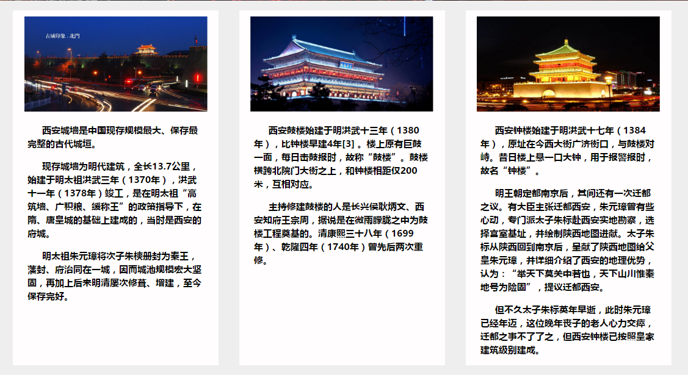
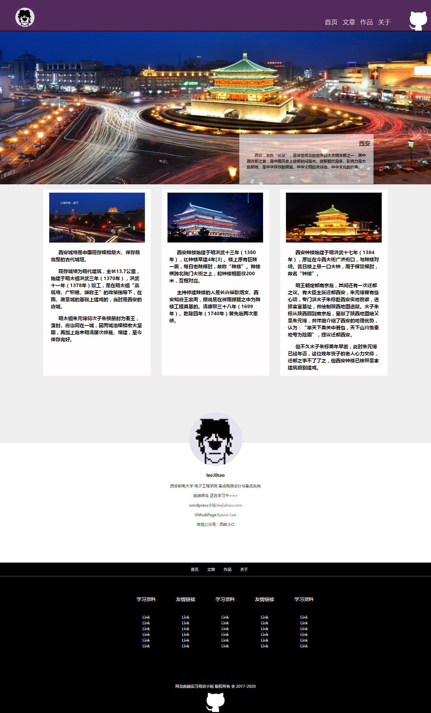
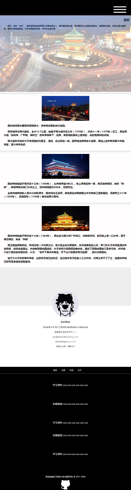
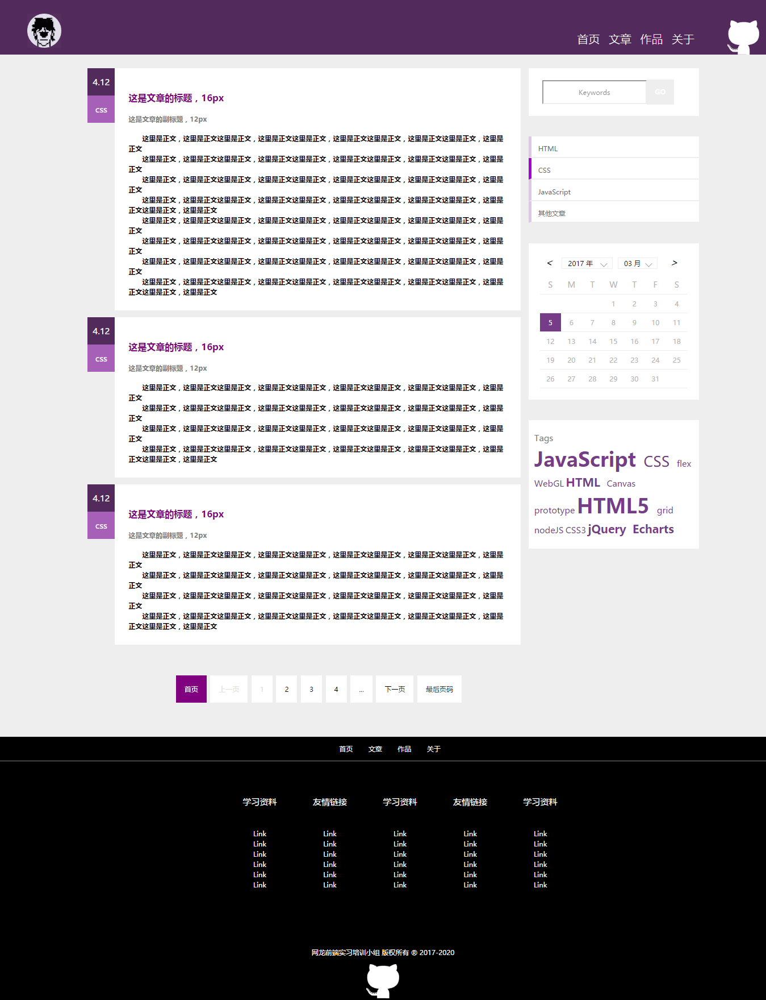
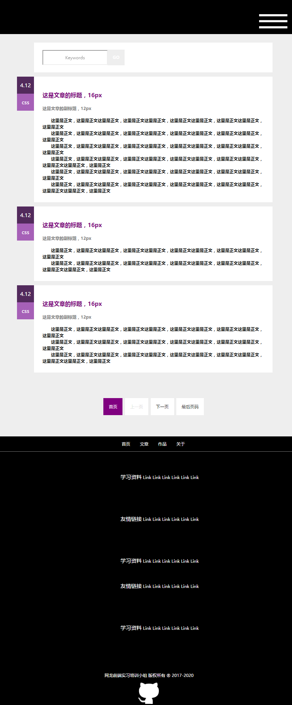
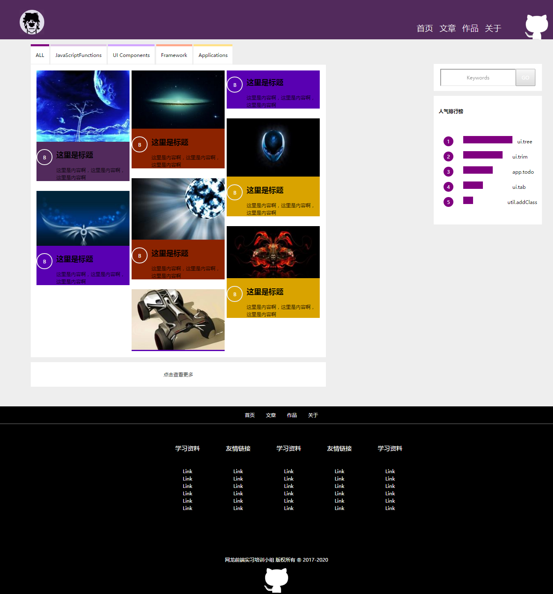
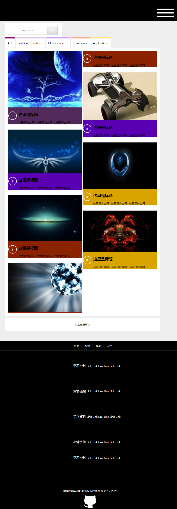
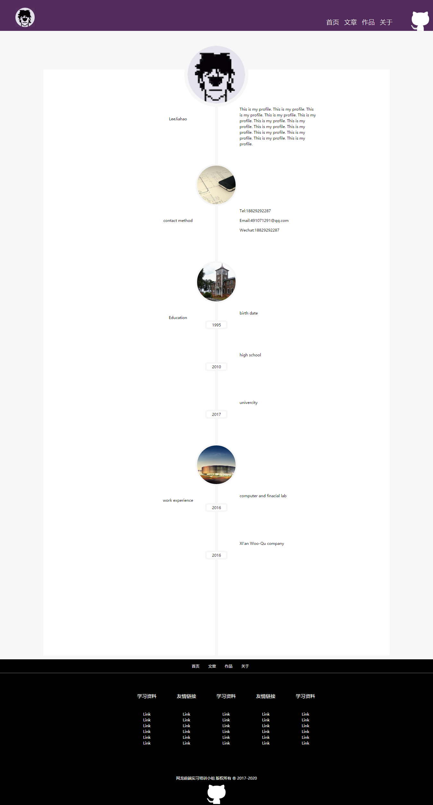
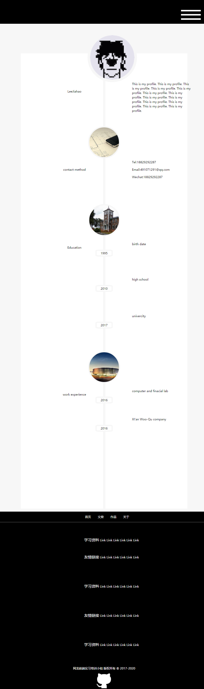
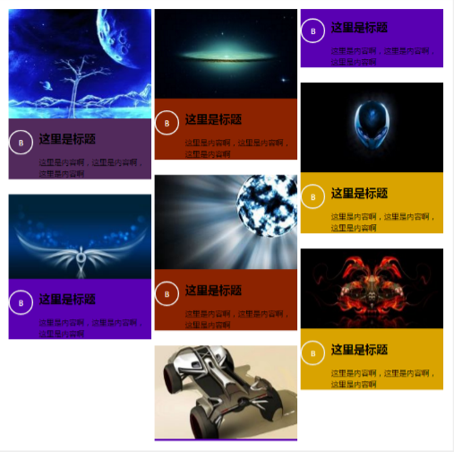

- 直接浏览效果 [点击浏览](http://htmlpreview.github.com/?https://github.com/EPSON-LEE/ND-FE-Intern-2017/blob/master/basic/MyBlog/index.html)

- 使用媒体查询实现不同分辨率设备不同的显示效果，当屏幕分辨率小于860px显示移动端布局

- index 页面下中图片说明性模块的三栏等高布局

    

- 在Blog页面中日历的年月日显示改为两个select框

	

- Index页面效果图

	- PC端
	
	

	- 移动端

	

- Blog页面效果图

	- PC端
	
	

	- 移动端

	

- Gallery页面效果图

	- PC端
	
	

	- 移动端

	

- Profile页面效果图

	- PC端
	
	

	- 移动端

	

- 遇到的问题
	
	1. Gallery页面中的瀑布流使用column布局时,一个图片解释框中的内容被切成两列
	
	

	